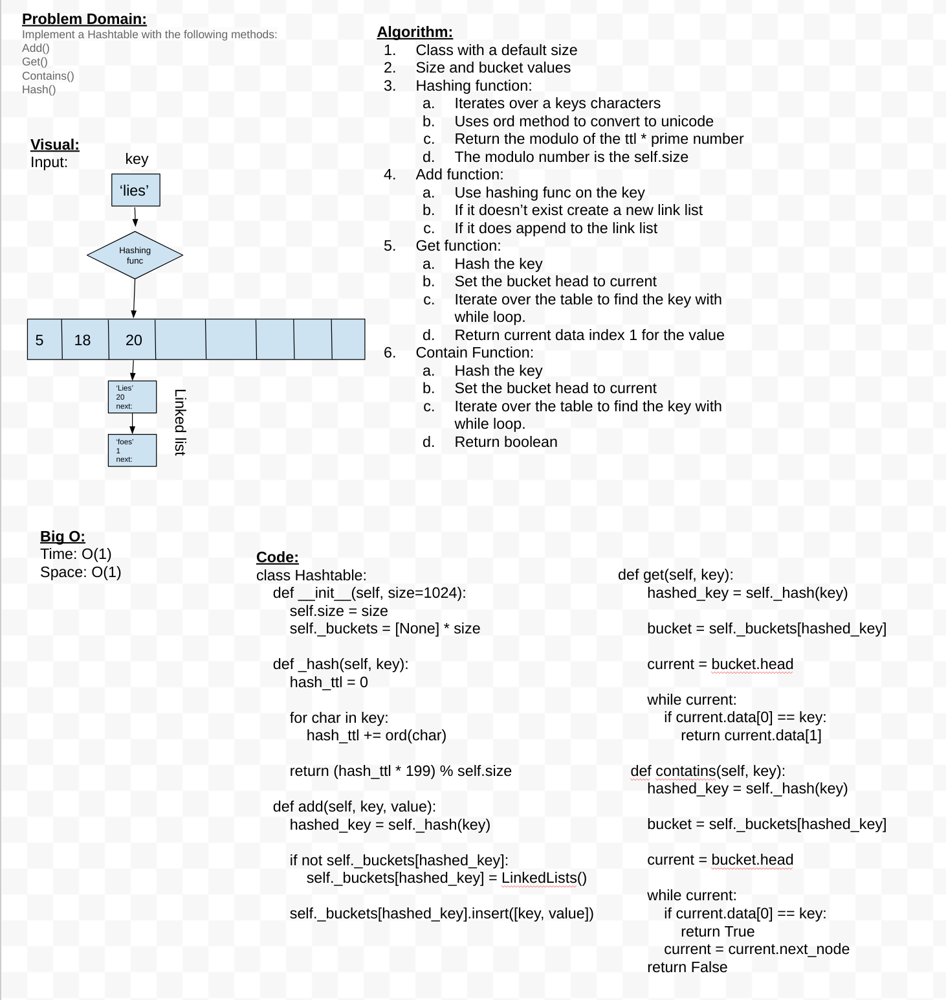

# Hashtables

A hash table organizes data so you can quickly look up values for a given key.

## Challenge

Implement a Hashtable with the following methods:

- `add`: takes in both the key and value. This method should hash the key, and add the key and value pair to the table, handling collisions as needed.
- `get`: takes in the key and returns the value from the table.
- `contains`: takes in the key and returns a boolean, indicating if the key exists in the table already.
- `hash`: takes in an arbitrary key and returns an index in the collection.

## Approach & Efficiency



Big O:
Time: O(1)
Space: O(1)

## API

```py
def contatins(self, key):
        """
        Returns a boolean if key exists in the hashtable

        Args:
            key (any): int or str

        Returns:
            bool: True or False
        """

    def get(self, key):
        """
        Get the value of the key

        Args:
            key (any): int or str

        Returns:
            value (any): int, str, list, dict
        """

    def add(self, key, value):
        """
        add a linkedlist to the hashtable bucket

        Args:
            key (any): any value
            value (any): int, str, list, dict
        """

    def _hash(self, key):
        """
        Converts key to a number to be stored.

        Args:
            key (type): any value

        Returns:
            int: the converted key to be stored
        """


```
