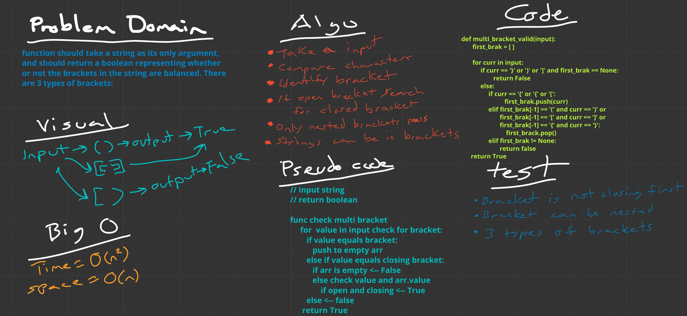

# Multi bracket validation
<!-- Short summary or background information -->
We need a method that iterates over a string and see's if it has open and closed brackets

## Challenge
<!-- Description of the challenge -->
Your function should take a string as its only argument, and should return a boolean representing whether or not the brackets in the string are balanced. There are 3 types of brackets:

- Round Brackets : ()
- Square Brackets : []
- Curly Brackets : {}

## Approach & Efficiency
<!-- What approach did you take? Why? What is the Big O space/time for this approach? -->
Check if it is a open bracket and store it if so in an empty array. Compare stored open bracket to next index value. if True pop.
time = O(n^2)
space = O(n)

## Solution
<!-- Embedded whiteboard image -->

