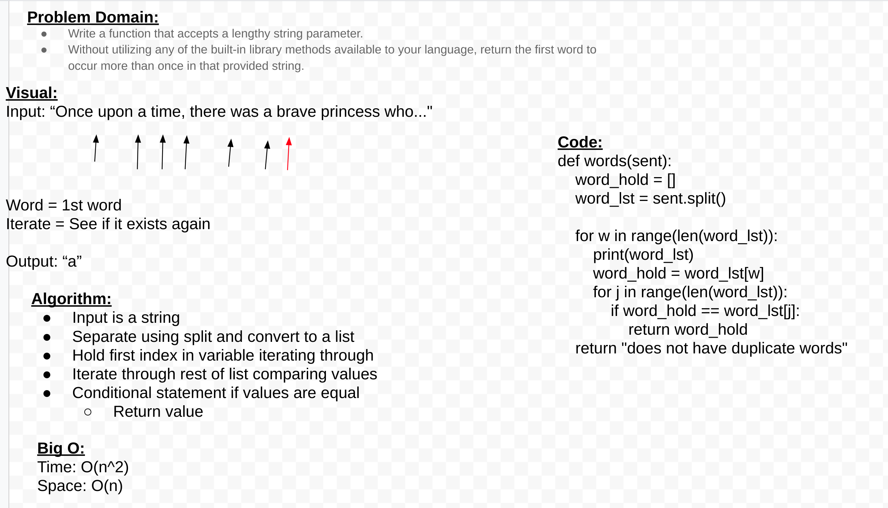

# Repeated words

Finds the first repeated words

## Challenge

Write a function that accepts a lengthy string parameter.
Without utilizing any of the built-in library methods available to your language, return the first word to occur more than once in that provided string.

## Approach & Efficiency

Big O:
Time: O(n^2)
Space: O(n)

## API

words()
