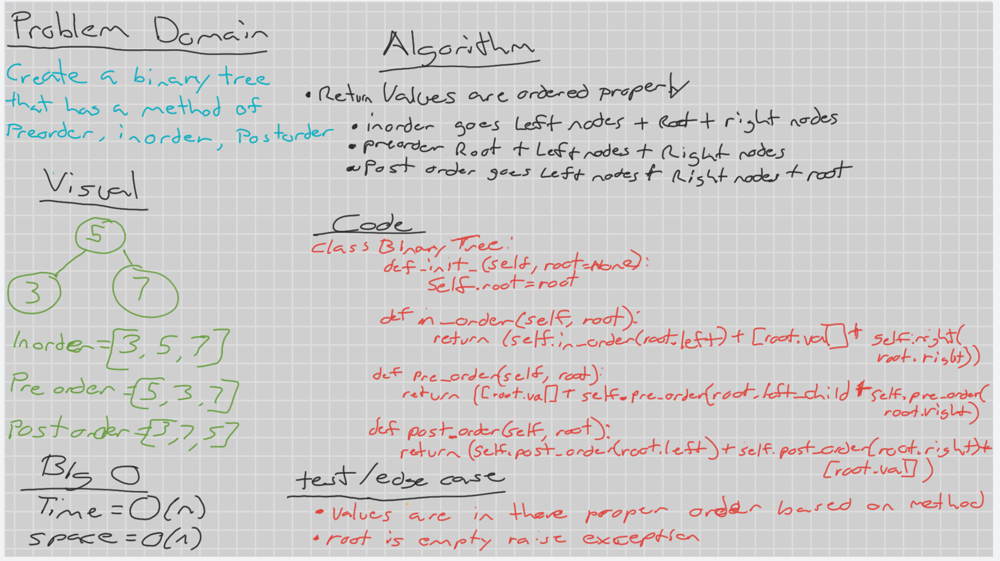
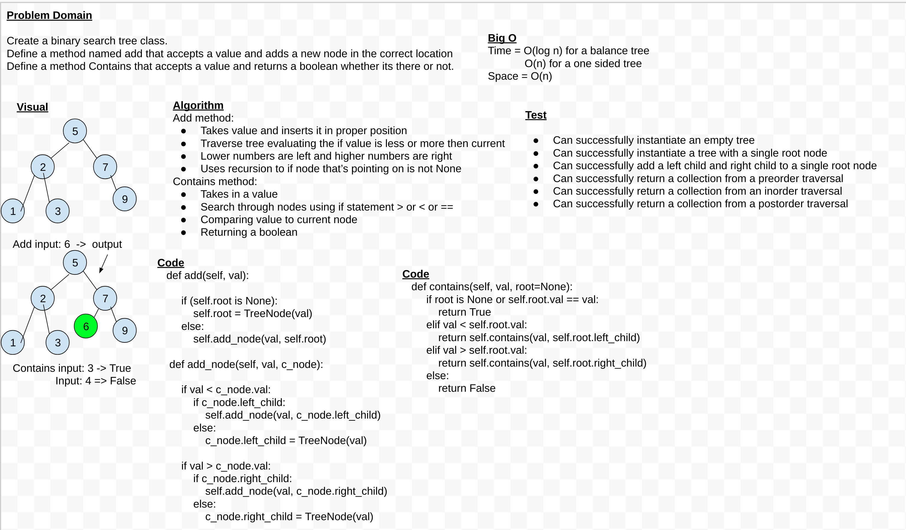
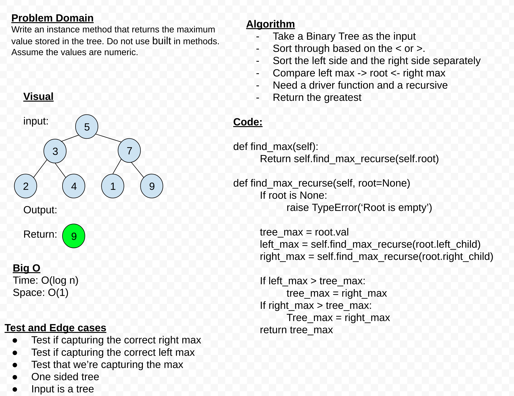
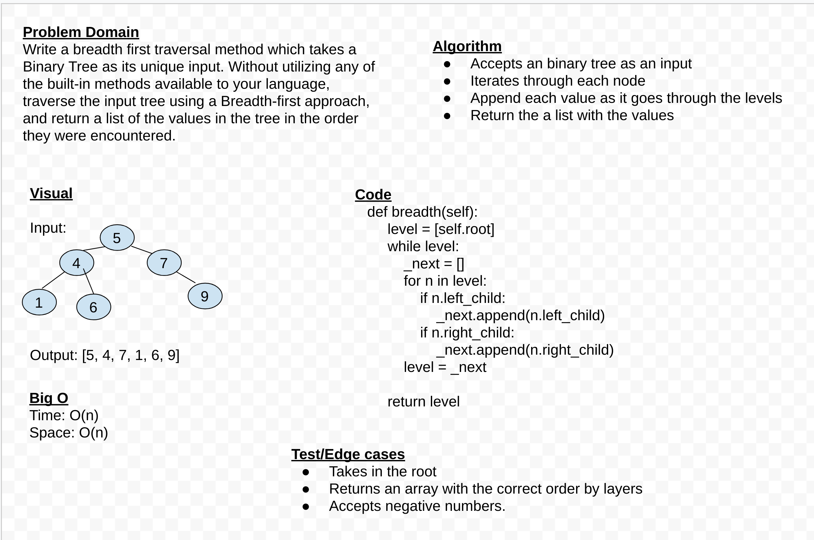

# Trees
<!-- Short summary or background information -->
Binary Search Tree, is a node-based binary tree data structure. They are useful for using the divide and conquer method for adding and searching nodes.

## Challenge
<!-- Description of the challenge -->
- Create a `Node` class that has properties for the `value` stored in the node, the `left child` node, and the `right child` node.

- Create a `BinaryTree` class:\
Define a method for each of the depth first traversals called `preOrder`, `inOrder`, and `postOrder` which returns an array of the values, ordered appropriately.

- Any exceptions or errors that come from your code should be semantic, capturable errors. For example, rather than a default error thrown by your language, your code should raise/throw a custom, semantic error that describes what went wrong in calling the methods you wrote for this lab.

- Create a BinarySearchTree class:\
Define a method named `add` that accepts a value, and adds a new node with that value in the correct location in the binary search tree.
Define a method named `contains` that accepts a value, and returns a boolean indicating whether or not the value is in the tree at least once.

## Approach & Efficiency
<!-- What approach did you take? Why? What is the Big O space/time for this approach? -->
## Binary Tree

Time = O(n)
Space = O(n)

## Binary Search Tree

Time = O(log n) *balanced*\
Time = O(n) *unbalanced*\
Space = O(n)

## Max-value

Time = O(log n) *balanced*\
Time = O(n) *unbalanced*\
Space = O(1)

## Breadth

Time = O(n)
Space = O(n)

## API
<!-- Description of each method publicly available in each of your trees -->

Tree Node -

- left Child\
- right child\
- value

`Add` - Adds a node in proper order

`Contains` - Returns boolean if value exists in tree

`Max` - find max value in the tree

`Breadth` - Return an array of all the levels in the tree.
