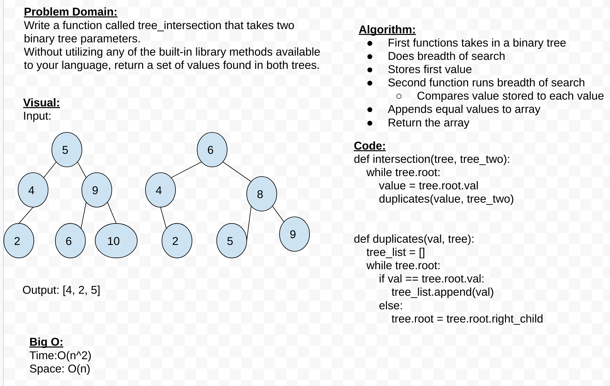

# Tree intersection

Finds where trees intersect

## Challenge

Write a function called tree_intersection that takes two binary tree parameters.
Without utilizing any of the built-in library methods available to your language, return a set of values found in both trees.

## Approach & Efficiency

Big O:
Time: O(n^2)
Space: O(n)

## API

tree_intersect()
