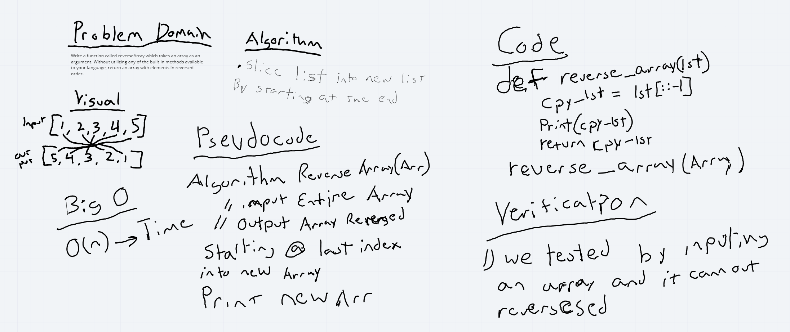

# Reverse an Array
<!-- Short summary or background information -->
We need a function that takes in an array returns in with the indexes reversed.

## Challenge
<!-- Description of the challenge -->
To create a function that takes in an array as a argument and returns it with all the values in reverse order.

## Approach & Efficiency
<!-- What approach did you take? Why? What is the Big O space/time for this approach? -->
Research list reverse method at https://www.youtube.com/watch?v=sGhY8dQdu4A. Used a slicer that creates a new array starting with the indexes at the end. Big O was O(n).

## Solution
<!-- Embedded whiteboard image -->
