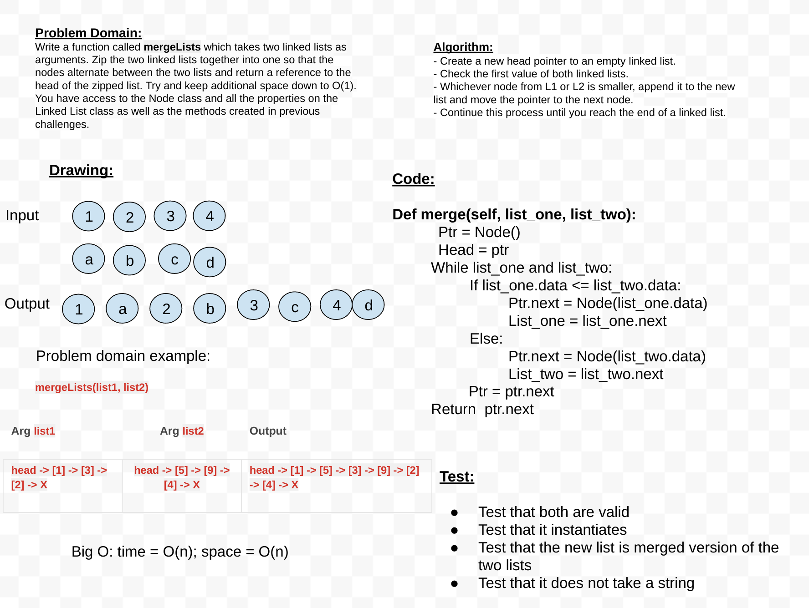

# Linked list Merge
<!-- Short summary or background information -->
This will merge to linked lists and alternate the nodes in sequential order

## Challenge
<!-- Description of the challenge -->
Write a function called mergeLists which takes two linked lists as arguments. Zip the two linked lists together into one so that the nodes alternate between the two lists and return a reference to the head of the zipped list. Try and keep additional space down to O(1). You have access to the Node class and all the properties on the Linked List class as well as the methods created in previous challenges.

## Approach & Efficiency
<!-- What approach did you take? Why? What is the Big O space/time for this approach? -->
While passing through 2 lists evaluate if the head of both do not equal "None". Create a pointer so you can compare the head of each list and which ever is lower becomes the new head. If it's higher check the next node in that list. Once you have gone through all the nodes it should return a merged linked lists head.
time = O(n)
space = O(n)
This is cause the list sizes can vary

`REFs` = https://www.youtube.com/watch?v=r3MAkVZkD0s

## Solution
<!-- Embedded whiteboard image -->
